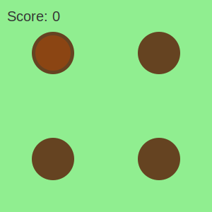

# blub
testing whack-a-mole in a README 

## 1. Include: Failed

## 2. base64: Failed

## 3. Embed: Failed

---
<svg xmlns="http://www.w3.org/2000/svg" width="300" height="200">
  
  <foreignObject width="100%" height="100%">
    

      <button onclick="this.style.setProperty('--count', parseInt(getComputedStyle(this).getPropertyValue('--count')) + 1)">
        Clicks: 
      </button>
    

  </foreignObject>
</svg>

---
